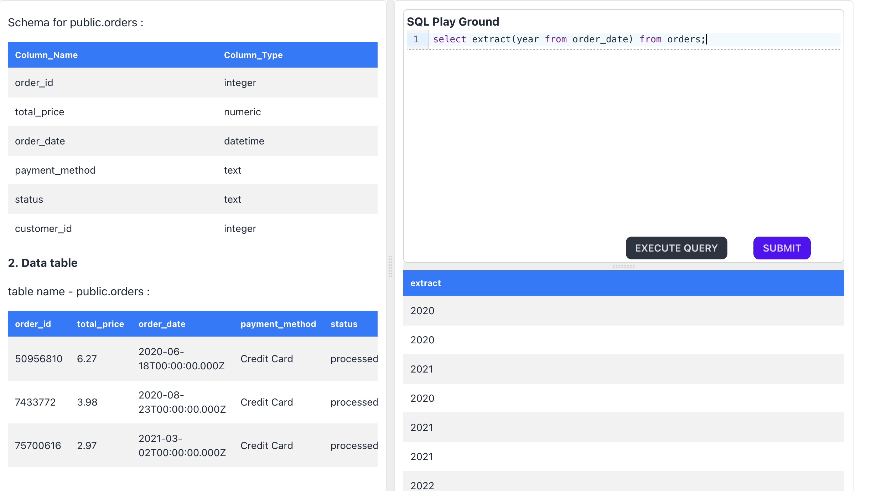
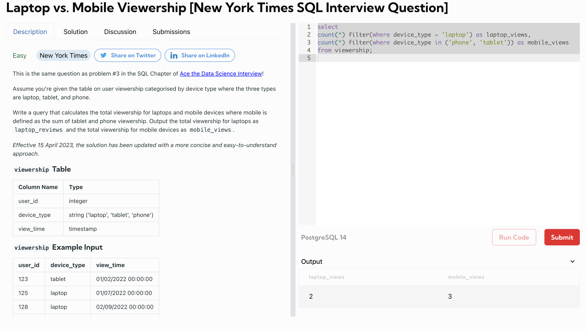

# Useful Commands
 This is the reference schema as well as a sample query
https://datalemur.com/questions
## Date and Time
- get year/month/day from a date - ` Select EXTRACT(YEAR/MONTH/DAY from order_date) from orders;` OR `SELECT DATE_PART('year', NOW()) AS current_year;`
- range queries on date - `SELECT * FROM orders
WHERE order_date BETWEEN '2024-01-01' AND '2024-12-31';`
- `select current_time;`
- `select now();`
- `select current_date;`
- `SELECT CURRENT_DATE + INTERVAL '7 days';`
- `SELECT CURRENT_DATE - INTERVAL '1 month';`
- select time interval b/w two dates - `SELECT AGE('2024-08-30', '2020-08-30') AS difference;`
# CASE statement:
```
SELECT 
    sale_id,
    amount,
    CASE
        WHEN amount > 1000 THEN 'High'
        WHEN amount BETWEEN 500 AND 1000 THEN 'Medium'
        ELSE 'Low'
    END AS sale_category
FROM sales;` 
```

# Filter
```
SELECT 
  COUNT(*) FILTER (WHERE device_type = 'laptop') AS laptop_views,
  COUNT(*) FILTER (WHERE device_type IN ('tablet', 'phone'))  AS mobile_views 
FROM viewership;
```



# COALESCE()
count(coalesce(q.query_id, 0))